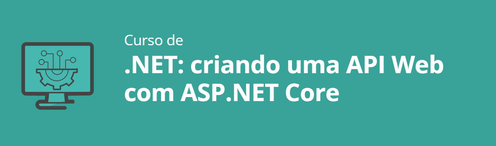

<h1>Objetivos</h1>
<ul>
    <li>Aprenda a estruturar um projeto console para utilizar uma Web API.</li>
    <li>Conheça a biblioteca ASP.NET Core e aplique ao projeto.</li>
    <li>Desenvolva uma API Mínima para o projeto ScreenSound.</li>
    <li>Aplique boas práticas no contexto de API Web para manter o projeto organizado e com melhor manutenção.</li>
    <li>Aprenda a documentar sua API utilizando o Swagger.</li>
    <li>Publique o banco e a API Web no Portal Azure.</li>
</ul>

<h1>Aprendizado do Curso</h1>
 <LI>CURSO EM ANDAMENTO...</LI>